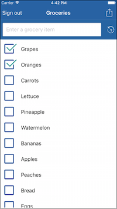
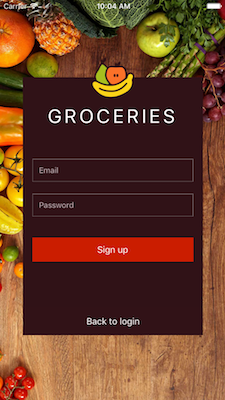
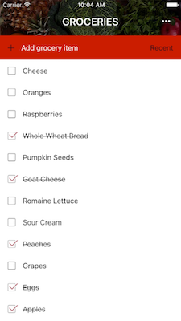
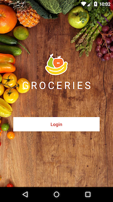
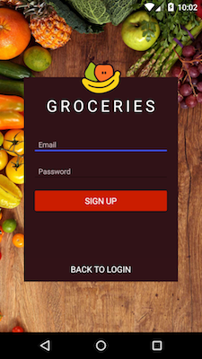
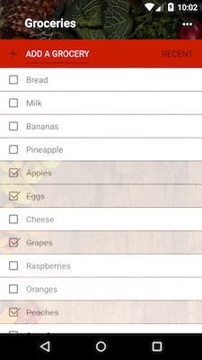

# Groceries [](https://travis-ci.org/NativeScript/sample-Groceries)

Groceries is a NativeScript-built iOS and Android app for managing grocery lists. You can learn how to build a version of this app from scratch using either our [JavaScript getting started guide](http://docs.nativescript.org/tutorial/chapter-0), or our [TypeScript and Angular getting started guide](http://docs.nativescript.org/angular/tutorial/ng-chapter-0).

<!-- * [Download](#download) -->

* [Branches](#branches)
* [Screenshots](#screenshots)
* [Development](#development)
    * [Linting](#linting)
    * [Unit testing](#unit-testing)
    * [Travis CI](#travis)
    * [Telerik Platform](#telerik-platform)
* [Contributors](#contributors)

<h2 id="branches">Branches</h2>

This repository contains a number of branches:

* The [**release** branch](https://github.com/NativeScript/sample-Groceries/) shows how to build a robust, real-world app using NativeScript. The branch is built with TypeScript and Angular.
This branch targets latest official release of {N}.

---

* The [**master** branch](https://github.com/NativeScript/sample-Groceries/tree/master) contains the same as relase branch, but it is configured against latest bits of {N}.

---

* The [**angular-end** branch](https://github.com/NativeScript/sample-Groceries/tree/angular-end) contains the finished code for the [NativeScript _TypeScript and Angular_ getting started guide](http://docs.nativescript.org/angular/tutorial/ng-chapter-0).

---

* The [**end** branch](https://github.com/NativeScript/sample-Groceries/tree/end) contains the finished code for the [NativeScript _JavaScript_ getting started guide](http://docs.nativescript.org/tutorial/chapter-0).

---

* The [**web** branch](https://github.com/NativeScript/sample-Groceries/tree/web) contains a web version of Groceries that shares code with the NativeScript-built native app. The app is built with the Angular CLI.
* The [**gh-pages** branch](https://github.com/NativeScript/sample-Groceries/tree/gh-pages) contains the GitHub Pages hosted version of the web branch. You can view the web app live at <https://nativescript.github.io/sample-Groceries>.

<h2 id="screenshots">Screenshots</h2>









<h2 id="development">Development</h2>

This app is built with the NativeScript CLI. Once you have the [CLI installed](https://docs.nativescript.org/start/quick-setup), start by cloning the repo:

```
$ git clone https://github.com/NativeScript/sample-Groceries.git
$ cd sample-Groceries
```

From there you can use the `run` command to run Groceries on iOS:

```
$ tns run ios
```

And the same command to run Groceries on Android:

```
$ tns run android
```

<h3 id="linting">Linting</h3>

Groceries uses [tslint](https://www.npmjs.com/package/tslint) + [codelyzer](https://github.com/mgechev/codelyzer) rules to ensure the code follows the [angular style guide](https://angular.io/docs/ts/latest/guide/style-guide.html).

You can run the linter with the `tslint` npm script:
```
$ npm run tslint
```

<h3 id="unit-testing">Unit Testing</h3>

Groceries uses NativeScript’s [integrated unit test runner](http://docs.nativescript.org/core-concepts/testing) with [Jasmine](http://jasmine.github.io/). To run the tests for yourself use the `tns test` command:

```
$ tns test ios --emulator
```

```
$ tns test android --emulator
```

For more information on unit testing NativeScript apps, refer to the [NativeScript docs on the topic](http://docs.nativescript.org/core-concepts/testing).

<h3 id="travis">Travis CI</h3>

Groceries uses [Travis CI](https://travis-ci.org/) to verify all tests pass on each commit. Refer to the [`.travis.yml` configuration file](https://github.com/NativeScript/sample-Groceries/blob/release/.travis.yml) for details.

<h3 id="telerik-platform">Telerik Platform</h3>

If you’d like to try developing Groceries without going through the full setup, you may be interested in loading the app in the [Telerik Platform](http://www.telerik.com/platform):

* [Run Groceries in the Telerik Platform](https://platform.telerik.com/#appbuilder/clone/https%3A%2F%2Fgithub.com%2FIcenium%2Fnativescript-sample-groceries)

<h2 id="contributors">Contributors</h2>

The following is a list of all the people that have helped build Groceries. Thanks for your contributions!

[](https://github.com/tjvantoll)[](https://github.com/hdeshev)[](https://github.com/vakrilov)[](https://github.com/Mitko-Kerezov)[](https://github.com/jlooper)[](https://github.com/rosen-vladimirov)

[](https://github.com/SvetoslavTsenov)[](https://github.com/ligaz)[](https://github.com/sis0k0)[](https://github.com/wdulin)[](https://github.com/dtopuzov)[](https://github.com/nadyaA)

[](https://github.com/vchimev)[](https://github.com/covex-nn)[](https://github.com/bundyo)[](https://github.com/EddyVerbruggen)[](https://github.com/NathanWalker)[](https://github.com/nsndeck)

[](https://github.com/tzraikov)[](https://github.com/TsvetanMilanov)[](https://github.com/bradmartin)[](https://github.com/cmelo)

<!-- Note: The table above get generated with the following commands -->
<!-- npm install -g github-contributors-list -->
<!-- githubcontrib --owner NativeScript --repo sample-Groceries --cols 6 --sortOrder desc | pbcopy -->

