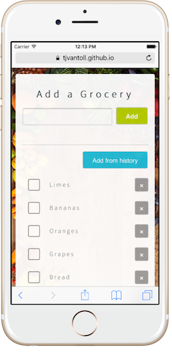

# Groceries

Groceries is a web-based grocery-management app built with Angular. The app was built to show how easy Angular makes it to share code across multiple environments. This web implementation shares its services with the [NativeScript-built iOS and Android Groceries app](https://github.com/NativeScript/sample-Groceries).

> **TIP**: You can learn more sharing code between web and native apps with Angular by watching [TJ VanToll and Jen Looper’s talk on the topic from ng-conf 2016](https://www.youtube.com/watch?v=R3nyG2xtzeQ).




## Development

To run Groceries you’ll first need to install the Angular CLI installed.

```
npm install -g @angular/cli
```

Next, clone this repo and switch to the “web” branch.

```
git clone https://github.com/NativeScript/sample-Groceries.git
cd sample-Groceries
git checkout web
```

Then, install this app’s dependencies from npm.

```
npm install
```

And finally, use the Angular CLI’s `ng serve` command to see Groceries running in your browser.

```
ng serve
```