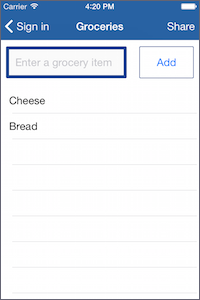
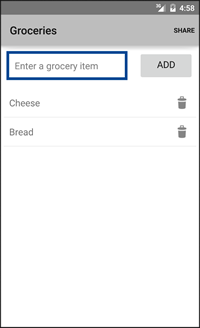

# Groceries

Groceries is a NativeScript-built iOS and Android app for managing grocery lists.







## Development

This app is built with the [NativeScript CLI](https://github.com/NativeScript/nativescript-cli). Once you have the [CLI installed](https://github.com/NativeScript/nativescript-cli#installation), start by cloning the repo:

```
$ git clone https://github.com/NativeScript/sample-Groceries.git
$ cd sample-Groceries
```

Next, install the app's npm dependencies:

```
$ npm install
```

From there you can use the `platform add` and `run` commands to run Groceries on iOS:

```
$ tns platform add ios
$ tns run ios --emulator
```

And the same commands to run Groceries on Android:

```
$ tns platform add android
$ tns run android --emulator
```

### Linting

Groceries uses [JSHint](http://jshint.com/) and [JSCS](http://jscs.info/) for code linting. To kick off both, use the app's `gulp lint` command:

```
$ gulp lint
```
