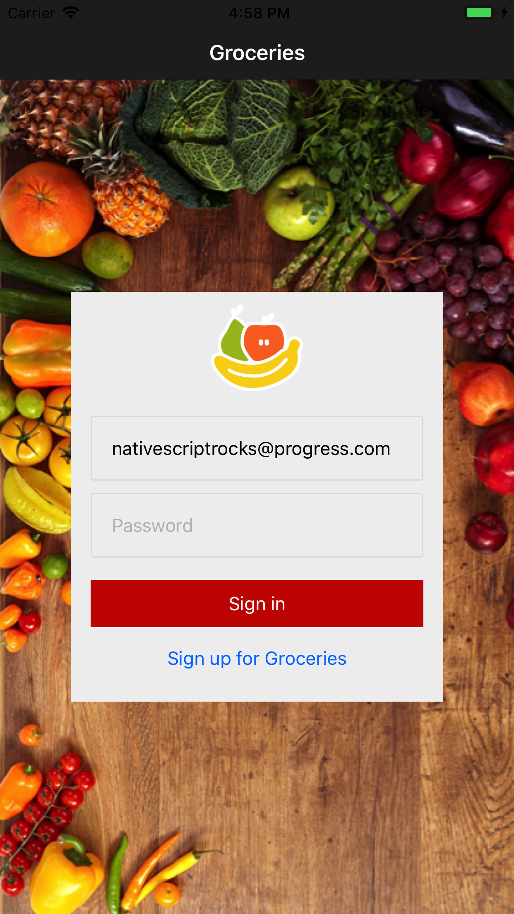

## Lesson 3. Adding Application Logic

In this chapter, you'll learn how to add JavaScript logic to your NativeScript app, and you'll be doing so using the base pattern on which the NativeScript framework is built, MVVM, or "model view view model". 

#### Background: MVVM

- **Model**: The model defines and represents the data. Separating the model from the various views that might use it allows for code reuse.
- **View**: The view represents the UI, which in NativeScript is written in XML. The view is often data-bound to the view model so that changes made to the view model in JavaScript instantly trigger visual changes to UI components.
- **View Model**: The view model contains the application logic (often including the model), and exposes the data to the view. NativeScript provides a module called 'Observable', which facilitates creating a view model object that can be bound to the view.

The biggest benefit of separating models, views, and view models, is that you are able to use two-way data binding; that is, changes to data in the model get instantly reflected on the view, and vice versa. The other big benefit is code reuse, as you're often able to reuse models and view models across views.

In Groceries, so far you've only touched the view (`login.xml`) and its css, but in this chapter you'll be creating a view model. To do so, we first need to introduce one other type of file: the code-behind.

#### End Background

### Step 1. Handling events

In NativeScript events are handled in a code-behind file, which is a JavaScript file that shares the same name as the view. For example, the login page's view is named `login.xml`, so its code-behind file is named `login.js`. The code-behind file is where you put all code that interacts with the view itself.

Let's look at what you can do in a code-behind file with a simple example.

<hr data-action="start" />

#### Action

* **a.** Open `app/views/login/login.xml` and add a `loaded` attribute to the `<Page>` UI component at the top. It should look like this:

``` XML
<Page loaded="loaded">
```

* **b.** Next, paste the code below in `app/views/login/login.js` to define a `loaded()` function:

``` JavaScript
exports.loaded = function() {
    console.log("hello");
};
```
* **c.** Save your files. When your app refreshes on your device, tap the **Sign in** button. You should see “hello” listed in the **Logs** section of Playground in your browser.

<hr data-action="end" />

#### Background: Exports

The keyword `exports` is part of [CommonJS](http://wiki.commonjs.org/wiki/Modules/1.1), the standard on which both NativeScript and Node.js' implementations of modules are based. In CommonJS-based JavaScript modules, a free variable called `exports` is an object to which a module might add properties and methods to configure its external API. Using `exports` in a code-behind file exposes the function for use in the view, or XML file. That is, the `exports.loaded` assignment in the code-behind file is what makes `loaded="loaded"` in the view work.

#### End Background

This simple example shows you how you can append attributes to UI components to run functions in the view's accompanying JavaScript file. Let's use another one of these attributes: `tap`.

<hr data-action="end" />

You can add a `tap` attribute that will fire when the user taps or touches a button. 

<hr data-action="start" />

#### Action

* **a.** In `app/views/login/login.xml`, switch the two buttons at the bottom of the screen to use this markup:

``` XML
<Button text="Sign in" tap="signIn" />
<Button text="Sign up for Groceries" class="link" tap="register" />
```

* **b.** Then, at the bottom of the `app/views/login/login.js` file, paste in the following `signIn()` and `register()` functions:

``` JavaScript
exports.signIn = function() {
    alert("Signing in");
};

exports.register = function() {
    alert("Registering");
};
```
* **c.** Save your files. At this point, if you run your app and tap either of the buttons, you will see the appropriate alerts pop up. 

<hr data-action="end" />

Now that you can see tap gestures working, let's make them do something more interesting than open alerts.

### Step 2. Binding to data

It's time to see how data flows back and forth between the front end and back end in forms.

<hr data-action="start">

#### Action

* **a.** Open `app/views/login/login.xml` and add an `id="email"` attribute to the email text field. Its markup should look like this:

``` XML
<TextField id="email" hint="Email Address" keyboardType="email" autocorrect="false" autocapitalizationType="none" />
```

With an `id` attribute in place, you can access this text field in your code-behind file. To do that, start by opening `app/views/login/login.js` and adding the two lines of code below at the top of the file:

``` JavaScript
var page;
var email;
```

* **b.** Next, edit the `loaded()` function in `login.js` to get a reference to the current page:

``` JavaScript
exports.loaded = function(args) {
    page = args.object;
};
```

> **NOTE**: This works because NativeScript passes `loaded` event handlers a reference to the `<Page>` in the function's argument, which is named `args` by convention.

* **c.** Finally, edit the `signIn()` function to get a reference to the text field component and log its contents:

``` JavaScript
exports.signIn = function() {
    email = page.getViewById("email");
    console.log(email.text);
};
```

<hr data-action="end">

#### Background: Component Inheritance

All NativeScript UI components, including `<Page>`, inherit from the [`View` class](http://docs.nativescript.org/api-reference/classes/_ui_core_view_.view.html), which gives them a number of methods for working the UI. In this case you use the [`getViewById()` method](http://docs.nativescript.org/api-reference/classes/_ui_core_view_.view.html#getviewbyid) to get a reference to the email text field by its `id` attribute.

#### End Background

To see how this works in action, run the app, type some text in the email address text field, and tap the “Sign in” button. If all went well, you should see the text you typed logged in your terminal.

By accessing UI elements in JavaScript, you can control how those elements look and behave on the front end. However, accessing these UI components individually is a very manual process, and it makes it hard to track the state of the UI. This is where view models come in.

### Step 3. Adding a view model

NativeScript provides view model functionality in the form of a module called 'Observable'.

The Observable is the view model in the MVVM design pattern. It provides a mechanism used for two-way data binding, to enable direct communication between the UI and code-behind file. This means that if the user updates the data in the UI, the change will be automatically reflected in the view model, and vice versa. 

<hr data-action="start">

#### Action

* **a.** To allow for two-way data binding using an Observable, open `app/views/login/login.xml`, and replace the two existing TextField UI components with the two shown below, each including a new `text` attribute:

``` XML
<TextField id="email" text="{{ email }}" hint="Email Address" keyboardType="email" autocorrect="false" autocapitalizationType="none" />
<TextField secure="true" text="{{ password }}" hint="Password" />
```

> **NOTE:**: The use of two curly brackets surrounding the `text` attribute's value delineates a data-bound value. You will be setting corresponding properties with the same name in the view model.

* **b.** Add the following code to the top of `app/views/login/login.js`. The code gets a reference to the `Observable` constructor from the observable module, and invokes the constructor to define a new `user` object, which you'll be using as this page's view model:

``` JavaScript
var observableModule = require("data/observable");

var user = new observableModule.fromObject({
    email: "nativescriptrocks@progress.com",
    password: "password"
});
```

* **c.** Now, replace the existing `loaded()` function with the one below, which sets `user` as the binding context for the page.

``` JavaScript
exports.loaded = function(args) {
    page = args.object;
    page.bindingContext = user;
};
```

<hr data-action="end">

#### Background: The View Model

1. You're creating a `user` view model that is based on the NativeScript Observable module. You create the view model with two properties, `email` and `password`, that are pre-populated with some dummy values.
2. You bind the page to the `user` view model by setting it as the page's `bindingContext` property. This is specifically what makes the curly bracket syntax work.

Simply put, properties placed on a page's binding context are available to XML elements using the `{{ propertyName }}` syntax. Because JavaScript sets the view model's `email` to `"nativescriptrocks@progress.com"`, and because you bound the email address text field to that property using `<TextField text="{{ email }}">`, when you run this app you'll see "nativescriptrocks@progress.com" appear on the front end.

#### End Background

What's really cool is that the binding you just enabled is two-way. This means that when the user types text in these text fields, those changes are immediately applied to your view model.




To pass these values to a backend service, you're going to need the ability to make HTTP calls. And to make HTTP calls in NativeScript you use the NativeScript fetch module. Let's look at how NativeScript modules work.

### Step 4. Connecting to a backend

Let's connect the login page to a RESTful API provided by [Telerik Backend Services](http://www.telerik.com/backend-services) to register the user for the Groceries service.

#### Background: More about modules

If you dig into `node_modules/tns-core-modules` you can get an idea of how these modules work. Start by finding the `node_modules/tns-core-modules/color` folder, which includes the implementation of the color module. It includes:

- a `package.json` file that sets the name of the module;
- a file containing the module's Android implementation (`color.android.js`);
- a file containing the module's iOS implementation (`color.ios.js`);
- a file containing code shared by the Android and iOS implementations (`color-common.js`)

> **NOTE**: You can refer to the [Node.js documentation on folders as modules](https://nodejs.org/api/modules.html#modules_folders_as_modules) for more detailed information on how NativeScript organizes its modules.

#### End Background


> **NOTE**: You don't have to use Telerik Backend Services as a backend service; you can use any HTTP API in a NativeScript app. Telerik Backend Services is convenient for us to use for this tutorial because it lets us spin up HTTP endpoints quickly.

Take a look at `app/shared/config.js`. There's only a small code snippet there, but it includes a hardcoded root path to the Groceries backend that the register page uses, and that you'll be using momentarily:

``` JavaScript
module.exports = {
    apiUrl: "https://api.everlive.com/v1/GWfRtXi1Lwt4jcqK/"
};
```
> **TIP**: `config.js` also shows a convenient pattern you can use for sharing configuration variables throughout your app.

Next, look in the `app/shared/view-models` folder, which contains a few view models that we've pre-packaged into Groceries. Those view models contain the code to hit our backend. You can see this demonstrated in the `user-view-model.js` file's `register()` function.

> **NOTE**: In a larger app, it's pretty common to place code that interacts with the backend in separate files, and not directly in the view models. But in our case, the connection code lives directly in the view model for simplicity—which is perfectly reasonable for small apps. 

#### Background: The Fetch module

Note that the `register()` function uses the config module to get the path to the backend, as well as the [fetch module]() to make HTTP calls.

``` JavaScript
var config = require("../../shared/config");
var fetchModule = require("fetch");
```

NativeScript's fetch module uses the same API as the [browser's new fetch() API](https://fetch.spec.whatwg.org/). Therefore, if you already know how to use the web's `fetch()` method, you already know how to make HTTP calls in NativeScript. Let's look at how the fetch module works by adding another method to the user view model.

#### End Background

<hr data-action="start">

#### Action

* **a.** Open `app/shared/view-models/user-view-model.js` and paste the following code directly above the existing `viewModel.register()` function:

``` JavaScript
viewModel.login = function() {
    return fetchModule.fetch(config.apiUrl + "oauth/token", {
        method: "POST",
        body: JSON.stringify({
            username: viewModel.get("email"),
            password: viewModel.get("password"),
            grant_type: "password"
        }),
        headers: {
            "Content-Type": "application/json"
        }
    })
    .then(handleErrors)
    .then(function(response) {
        return response.json();
    })
    .then(function(data) {
        config.token = data.Result.access_token;
    });
};
```
<hr data-action="end">

#### Background: Understanding the login routine

Let's break down what the code you just pasted in does.

- You use the fetch module's `fetch()` method to POST data to the `apiUrl` stored in `shared/config.js`. The username, password and grant_type are sent to this endpoint as a JSON string. (Telerik Backend Services [requires a grant_type parameter](http://docs.telerik.com/platform/backend-services/development/rest-api/users/authenticate-user) for logins.)

- The `fetch()` method returns a `Promise`, which allows you to execute code after the asynchronous login either completes successfully or fails. You use this functionality to do three things (the three `then()` handlers).
    - First, you handle any errors in the HTTP response with a `handleErrors()` function defined at the bottom of `user-view-model.js`. (If you want more details on how handling HTTP response errors with `fetch()` works check out [this article](http://tjvantoll.com/2015/09/13/fetch-and-errors/).)
    - Next, you convert the returned data into JSON by calling the [`Response`](https://developer.mozilla.org/en-US/docs/Web/API/Response) object's `json()` method.
    - Finally, you save a reference to the user's authentication token in the config module. You'll use that token on subsequent HTTP requests later in this guide.

> **TIP**:
> * [Promises](https://developer.mozilla.org/en-US/docs/Web/JavaScript/Reference/Global_Objects/Promise) are a part of ECMAScript 6 (the scripting language of which JavaScript is an implementation). Because Promises have been implemented in the two JavaScript engines NativeScript uses—V8 for Android and JavaScriptCore for iOS—Promises are available for use in NativeScript apps.
> * NativeScript makes `fetch()` available as a global variable for convenience. This means you can replace `fetchModule.fetch()` with `fetch()`. The global `fetch()` shortcut will be used for the remainder of this guide.

> #### End Background

With this code in place let's return to `login.js` to use this new function.

<hr data-action="start">

#### Action

* **a.** In `app/views/login/login.js`, at the top of the file, add the following reference to `shared/view-models/user-view-model`:

``` JavaScript
var UserViewModel = require("../shared/view-models/user-view-model");
```
* **b.** **Remove** the following five lines of code, as you'll be using the `UserViewModel` instead of the `user` you added in the previous chapter.

<div class="no-copy-button"></div>

``` JavaScript
// Remove these lines of code
var observableModule = require("data/observable");

var user = new observableModule.fromObject({
    email: "nativescriptrocks@progress.com",
    password: "password"
});
```
* **c.** Next, add the following line of code after the `var UserViewModel = require(...)` line:

``` JavaScript
var user = new UserViewModel();
```

* **d.** Finally, replace the `exports.signIn()` function with the code below:

``` JavaScript
exports.signIn = function() {
    user.login();
};
exports.register = function() {
    user.register();
};
```
* **e.** Tap the "Sign up" link to register a new user, and then login using the same username you just created. 

> **TIP**: You can always view the completed codebase in the “end” branch of the [sample-Groceries repo](https://github.com/NativeScript/sample-Groceries/tree/end).

<hr data-action="end">

#### Background: a clean codebase

Take a moment to look at just how clean your code-behind file is now. The code-behind instantiates a view model (`UserViewModel`), and calls its `signIn()` method when the user taps the view's sign in button. Because the view model is bound to the page's two text fields (remember `{{ email }}` and `{{ password }}`), the view model already has the data it needs to perform the actual login.

#### End Background

If you try running your app, and input your account's credentials, you can indeed register and login, but... you don't see anything happening on the screen. That's because view models aren't responsible for updating the UI. Instead the view model returns a `Promise` to let the code-behind handle the UI. (Remember that `fetch()` returns a `Promise`.) Let's see how you can use that `Promise`, and introduce a new NativeScript module in the process.

### Step 5. The Dialog module

To utilize the `Promise` that the view model's `login()` function returns, you need to handle two scenarios: what to do when the login works, and what to do when it doesn't.

In the case of Groceries, when the login works you're going to navigate the user to the list page, which you'll be building momentarily, and which will let the user add and remove groceries from a list.

The trickier situation is handling authentication failures, and for that you're going to use the dialog module. You can use this module to show a popup in your app, including action sheets, confirmation boxes, alert boxes, and prompts. It is a highly customizable module, and it lets you control the buttons in your alerts, their text, and the messaging in the alert itself. The dialog module's code is in the `node_modules/tns-core-modules/ui` folder with other UI widgets. Let's see how to use this widget on the login page.

<hr data-action="start">

#### Action

* **a.** Add the following lines to the top of `app/views/login/login.js` to import the dialog module and the frame module (which we will use later to navigate to a list page):

``` JavaScript
var dialogsModule = require("ui/dialogs");
var frameModule = require("ui/frame");
```

* **b.** Next, re-write your `signIn()` and `register()` functions to look like this:

``` JavaScript
exports.signIn = function() {
    user.login()
        .catch(function(error) {
            console.log(error);
            dialogsModule.alert({
                message: "Unfortunately we could not find your account.",
                okButtonText: "OK"
            });
            return Promise.reject();
        })
        .then(function() {
            frameModule.topmost().navigate("views/list/list");
        });
};

exports.register = function() {
    user.register()
        .then(function() {
            dialogsModule
                .alert("Your account was successfully created.")
                .then(function() {
                    exports.toggleDisplay();
                });
        }).catch(function(error) {
            dialogsModule
                .alert({
                    message: "Unfortunately we were unable to create your account.",
                    okButtonText: "OK"
                });
        });
};
```
<hr data-action="end">

This code handles both a successful and unsuccessful authentication routine. On success, you call the frame module's `navigate()` method to navigate the user to the (currently empty) list page. On failure, you use the dialog module to show the user an error message. Try inputting some invalid credentials to see what the dialog looks like.

With that, the login page is completely functional. Now that you have user management working in your NativeScript app, let's move onto the page where users will manage their grocery list. To do that, you need a module that shows items in a list, which is exactly what the ListView module does.

> **TIP**: From this point forward in the guide you'll have to log in a lot, so you may find it helpful to hardcode your credentials in the app during development. The easiest way to do that is to pass an email address and password to the `UserViewModel()` constructor, for example:

> ``` JavaScript
> var user = new UserViewModel({
>     email: "user@nativescript.org",
>     password: "password"
> });
> ```

In the next section we're going to polish the Login and Registration routines a little more, and then turn to creating a list to display our groceries.