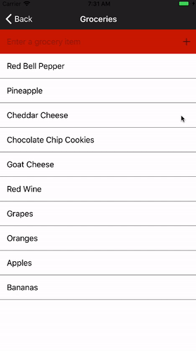
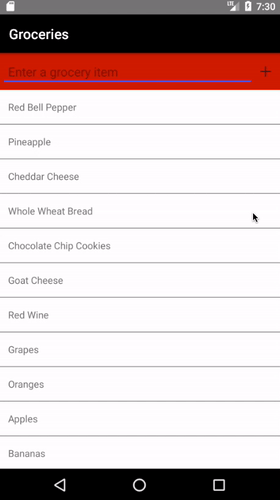
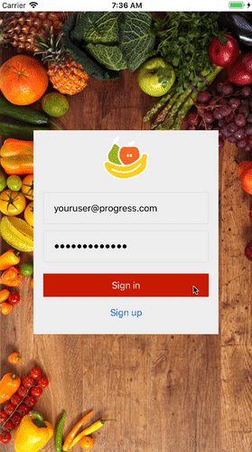
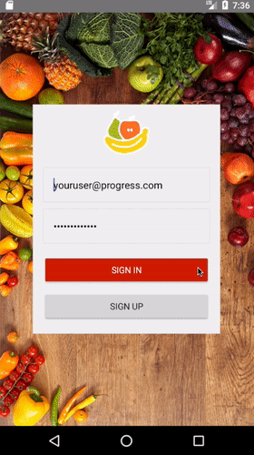

## Lesson 4. Building Polished User Interfaces

In this chapter you'll learn how to use several NativeScript features that let you build professional mobile user interfaces, such as listviews, layouts, and animations.

In the process you’ll complete the Groceries app, and have a functioning list-based app that you can share with your friends. Let’s get started by looking at some things you can do to customize NativeScript UI components.

### Step 1. Customizing UI components

Each UI component has a set of properties and methods you can use to customize your app.

#### Background: NativeScript modules

All NativeScript UI components are implemented as NativeScript modules, which are a series of TypeScript modules you use to add powerful functionality to your apps. There are a [lot of these modules](https://docs.nativescript.org/angular/core-concepts/modules), and you will use several of them as you complete this tutorial.

The source code for the NativeScript modules lives on GitHub in the [NativeScript/NativeScript repo](https://github.com/nativescript/nativescript). The modules are [distributed through npm as a “tns-core-modules” package](https://www.npmjs.com/package/tns-core-modules), which all NativeScript apps depend on. Because the NativeScript modules are open source, you are welcome to [contribute changes](https://www.nativescript.org/contribute).

#### End Background

In the next example you’re going to hide the `<ActionBar>` on the login page. On Android an `<ActionBar>` shows in your app even if you don’t explicitly include an `<ActionBar>` in your template. (The title defaults to the name of your app.) To hide the `<ActionBar>` you have to set a property of the `<Page>` object.

<hr data-action="start" />

#### Action

* **a.** Open your `app/views/login/login.js` file, and add following code to the `exports.loaded()` function under the declaration for `page` .

``` JavaScript
page.actionBarHidden = true;
```

#### Background: About the Page class

This code uses an instance of the [`Page` class](https://docs.nativescript.org/api-reference/classes/_ui_page_.page.html) from the [NativeScript page module](https://docs.nativescript.org/api-reference/modules/_ui_page_.html), and sets its `actionBarHidden` property to `true`, which hides the ActionBar that shows by default on Android devices.

Although you can peruse the [NativeScript API documentation](http://docs.nativescript.org/api-reference/globals.html) for a full list of these properties and what they do, if you’re using a TypeScript-friendly IDE, you can get a full list of these properties at any point. You can see this behavior in NativeScript Playground as you type `this.page.` while editing your `login.component.ts` file.

#### End Background

Let's make one more change to the Login screen before moving on to build out the grocery list screen.

### Step 2. Enhancing the Login Screen

On the login page, we need to make the user experience better, so that it's clear whether the user is logging in or registering. Let's make the screen switch colors dynamically, depending on the user's choice.

<hr data-action="start">

#### Action

* **a.** We're going to switch the color of the screen and the action of the button and link, depending on whether the user wants to login or register. First, let's alter some CSS. Open `app/views/login/login.css` and add these styles:

``` CSS
.dark {
  background-color: #301217;
}
.dark TextField {
  color:  #C4AFB4;
}
```

* **b.** Next, create a binding for the style that we want to dynamically switch. Open `app/views/login/login.xml` and replace the StackLayout with the following:

``` XML

        <StackLayout id="form" class="{{ isLoggingIn ? 'form' : 'form dark' }}" orientation="vertical">
            <Image src="~/images/logo" />

            <TextField class="input input-border" id="email" text="{{ email }}" hint="Email Address" keyboardType="email" autocorrect="false" autocapitalizationType="none" />
            <TextField class="input input-border" secure="true" text="{{ password }}" hint="Password" />

            <Button class="btn btn-primary" text="{{ isLoggingIn ? 'Sign in' : 'Sign up' }}" tap="submit" />
            <Button text="{{ isLoggingIn ? 'Sign up' : 'Back to login' }}" class="link" tap="toggleDisplay" />
        </StackLayout>

```
Here, you've created a binding for the class, to test for a change in the value of the boolean `isLoggingIn` and switching the css class of the form from `form` to `form dark` if the user switches from logging in to registering. You've also altered the Button's text with a similar bound value, and changed the button to trigger the `submit` function and the link to `toggleDisplay`.

* **c.** Now, build out the `submit` and `toggleDisplay` functions. Open `app/views/login/login.js` and overwrite the `loaded`, `login` and `register` functions:

``` JavaScript
exports.loaded = function(args) {
    page = args.object;
    page.actionBarHidden = true;
    isLoggingIn = user.isLoggingIn;    
    page.bindingContext = user;
};

exports.toggleDisplay = function() {
    isLoggingIn = !isLoggingIn;
    user.set('isLoggingIn', isLoggingIn);
};

exports.submit = function(){
    if (isLoggingIn) {
        login();
      } else {
        signUp();
      }
};

function login() {
    user.login()
        .catch(function(error) {
            dialogsModule.alert({
                message: "Unfortunately we could not find your account.",
                okButtonText: "OK"
            });
            return Promise.reject();
        })
        .then(function() {
            frameModule.topmost().navigate("views/list/list");
        });
};

function signUp() {
    user.register()
        .then(function() {
            dialogsModule
                .alert("Your account was successfully created.")
                .then(function() {
                    exports.toggleDisplay();
                });
        }).catch(function(error) {
            dialogsModule
                .alert({
                    message: "Unfortunately we were unable to create your account.",
                    okButtonText: "OK"
                });
        });
};
```
Here, you've created a `submit` routine that tests for the `isLoggingIn` boolean and either triggers `login` or `signUp`, depending on the boolean's value.

The boolean `isLoggingIn` is set when the user taps the bottom link, via the `toggleDisplay` function. Note that the `login` and `signUp` functions are no longer `exports.login` or `exports.signUp`. This is because they are not called from the XML, so they do not have to be exposed to the front end.

If you were to test the screen switching at this point, nothing would happen. That's because we have one more step: we need to add the boolean `isLoggingIn` to the View Model's observable, so that values that change can be observed by the view tier. 

* **d.** Open `app/shared/view-models/user-view-model.js` and edi the viewModel Observable at the top:

``` JavaScript
var viewModel = new Observable({
    email: info.email || "",
    password: info.password || "",
    isLoggingIn: true
  });
```
 
Now, you have a much better user experience, with the screen color clearly indicating which action the user is performing.  

### Step 3. Introducing NativeScript UI

In addition to the NativeScript [core user interface components](https://docs.nativescript.org/ui/components), many of which you’ve used throughout this guide, NativeScript additionally provides a collection of free, professional components collectively known as [NativeScript UI](https://www.nativescript.org/ui-for-nativescript).

NativeScript UI contains controls for building drawers, listviews, calendars, charts, forms, autocompletes, and more. In fact, the graph you saw back in lesson one of this tutorial was a NativeScript UI component. To show what NativeScript UI can do, let’s look at to use the suite’s listview control to start to add a grocery list to your app.

#### Background: NativeScript plugins

NativeScript UI is a NativeScript plugin. [NativeScript plugins](https://docs.nativescript.org/plugins/plugins) are npm packages with some added native functionality, such as the ability to leverage Android and iOS SDKs.

Because NativeScript plugins require full iOS and Android builds to use, normally you cannot use NativeScript plugins in the NativeScript Playground environment.

However, a few NativeScript plugins have built-in support in NativeScript Playground, including NativeScript UI, [the accelerometer plugin](https://market.nativescript.org/plugins/nativescript-accelerometer), and the [geolocation plugin](https://market.nativescript.org/plugins/nativescript-geolocation). You can [learn more about using plugins on the NativeScript documentation](https://docs.nativescript.org/plugins/plugins), and you can [peruse available plugins on the NativeScript Marketplace](https://market.nativescript.org/plugins/nativescript-geolocation).

#### End background

<hr data-action="start">

#### Action

* **a.** Open `app/views/list/list.xml` and paste in the code below, which creates the list where your groceries will reside:

``` XML
<Page loaded="loaded" xmlns:lv="nativescript-pro-ui/listview">
    <GridLayout>
        <lv:RadListView items="{{ groceryList }}" row="1">
	        <lv:RadListView.itemTemplate>
	            <GridLayout class="grocery-list-item">
	                <Label class="p-15" text="{{ name }}"/>
	            </GridLayout>
	        </lv:RadListView.itemTemplate>
    		</lv:RadListView>
    </GridLayout>
</Page>
```
<hr data-action="end">

#### Background: The xml namespace

XML namespaces are used for providing uniquely named elements and attributes in an XML document. Since we are creating a RadListView using the custom XML tag `lv`, we need to declare it at the top using the xmlns format. 

#### End Background

If you run this code as is, you won't see any items in the grocery list. First you need to build out a way to manage data within the list, and to do that you're going to need a new NativeScript module: the ObservableArray.

### Step 4. Working with Arrays

In the previous section of this guide you saw how to create observables and how to use them to connect XML views with code-behind files and view models. You're going to do the same thing in this section with one additional twist, and it involves making populating the `items` array.

The `RadListView` pro UI element's `items` attribute takes an array, and to create that array on the view model, NativeScript provides a special ObservableArray module. To see how it works, let's start building the list page's code-behind file.

<hr data-action="start">

#### Action

* **a.** Open `app/views/list/list.js` and paste in the following code:

``` JavaScript
var dialogsModule = require("ui/dialogs");
var observableModule = require("data/observable")
var ObservableArray = require("data/observable-array").ObservableArray;
var page;

var pageData = new observableModule.fromObject({
    groceryList: new ObservableArray([
        { name: "eggs" },
        { name: "bread" },
        { name: "cereal" }
    ])
});

exports.loaded = function(args) {
    page = args.object;
    page.bindingContext = pageData;
};
```
<hr data-action="end">

#### Background: The observable object

Here, you're creating a new Observable object called `pageData`, which you set as the page's `bindingContext` in the `loaded()` function. Inside the Observable, you set a single `"groceryList"` property to be a new instance of the ObservableArray class. Notice how the `"groceryList"` property corresponds to `<ListView items="{{ groceryList }}">`, and each array entry's `"name"` property corresponds to `<Label text="{{ name }}">`.

> **NOTE**: Notice how this example uses the observable module’s `fromObject()` method instead of the `Observable` class constructor. Both `observableModule.fromObject()` and `new Observable()` create a new `Observable` instance, however, the `fromObject()` method performs a bit of additional initialization to handle nested objects. This example uses `fromObject()` because the `pageData` observable object contains a nested `ObservableArray`.

#### End Background

If you run your app you'll see the list screen shows the hardcoded data:

** TODO insert pics of hardcoded screen data **

#### Background: More about the `p-15` class name

The NativeScript Core Theme contains a number of class names that let you control the spacing of UI components within your application.

The class names follow a convention of margin/padding - top/bottom/left/right - amount. So for example, `<Label class="m-t-2">` renders a label with a `margin-top` of `2`, and `<Label class="p-b-5">` renders a label with a `padding-bottom` of `5`.

Therefore, in the example above `<Label class="p-15">` applies `padding: 15` to the label. You can [learn more about these class names on the NativeScript docs](https://docs.nativescript.org/ui/theme#padding-and-margin).

#### End Background

Now that we have items on the screen let's look at how you can tie this list to a backend instead of hardcoded data. To do so you'll switch the list page to use a view model, much like you did with the login page.

A starting view model for this page is already in the file at `app/shared/view-models/grocery-list-view-model.js`, which contains code that looks a lot like what you already have in `list.js`:

``` JavaScript
var config = require("../../shared/config");
var fetchModule = require("fetch");
var ObservableArray = require("data/observable-array").ObservableArray;

function GroceryListViewModel(items) {
    var viewModel = new ObservableArray(items);
    return viewModel;
}

module.exports = GroceryListViewModel;
```

Let's expand on this to tie this view model to a backend.

<hr data-action="start">

#### Action

* **a.** Start by changing `app/views/list/list.js` to use the `GroceryListViewModel`. First, `require()` the `GroceryListViewModel` so you can use it:

``` JavaScript
var GroceryListViewModel = require("../shared/view-models/grocery-list-view-model");
```

* **b.** Next, **remove** the existing `var pageData` assignment:

``` JavaScript
// Remove these seven lines of code
var pageData = new observableModule.fromObject({
    groceryList: new ObservableArray([
        { name: "eggs" },
        { name: "bread" },
        { name: "cereal" }
    ])
});
```

* **c.** And add the code below in the same location:

``` JavaScript
var groceryList = new GroceryListViewModel([]);
var pageData = new observableModule.fromObject({
    groceryList: groceryList
});
```

* **d.** Finally, replace the existing `exports.loaded()` function with the one below, which calls two new methods on the view model—`empty()` and `load()`.

``` JavaScript
exports.loaded = function(args) {
    page = args.object;
    page.bindingContext = pageData;

    groceryList.empty();
    groceryList.load();
};
```

In this code, `groceryList` is referencing the grocery list model, and the `empty()` function empties the list, and then calls the view model's `load()` function to reload the data from the backend.

The last piece to make this work is actually implementing the `empty()` and `load()` functions in the view model. 

* **e.** Open `app/shared/view-models/grocery-list-view-model.js`, and paste the following code between the `var viewModel` assignment, and the `return viewModel` statement.

``` JavaScript
viewModel.load = function() {
    return fetch(config.apiUrl + "Groceries", {
        headers: {
            "Authorization": "Bearer " + config.token
        }
    })
    .then(handleErrors)
    .then(function(response) {
        return response.json();
    }).then(function(data) {
        data.Result.forEach(function(grocery) {
            viewModel.unshift({
                name: grocery.Name,
                id: grocery.Id
            });
        });
    });
};

viewModel.empty = function() {
    while (viewModel.length) {
        viewModel.pop();
    }
};
```

<hr data-action="end">

When your app refreshes on your device you’ll see a blank list page, but you didn’t do anything wrong! Your app now reads grocery data from a backend, but you don’t have any groceries associated with your new account.

To really test out these changes you’ll need to allow users to add groceries to their lists, so let’s look at how to do that next.

### Step 5. Using advanced layouts

In order to allow users to add to their grocery lists, you need to add a few additional UI controls to the list page. While you could use a simple `<StackLayout>` to stack up the controls you need, let’s look at how to create a slightly more complex layout using the `<GridLayout>` element.

<hr data-action="start" />

#### Action

* **a.** Open `app/views/list/list.xml` and change the `<GridLayout>` tag to use the code below:

``` XML
<GridLayout rows="auto, *">
```

The `rows` attribute divides the screen into two rows, the first auto-sized according to its childrens' height, and the other to contain \*, or the remaining height of the screen.

* **b.** Next, to give the user a way to add groceries to the list, add a text field and a button to the page. Add these two lines of code directly after the initial `<GridLayout>` tag:

``` XML
<GridLayout row="0" columns="*, auto" class="add-bar">
    <TextField id="groceryTextField" text="{{ grocery }}" hint="Enter a grocery item" col="0"/>
    <Image src="~/images/add" tap="add" col="1"/>
</GridLayout>
```

#### Background: More details about this layout

The text field has an id attribute of `"grocery"`, and is bound to the `{{ grocery }}` property of the page's binding context. The button's `tap` event refers to an `add()` function, that you'll add to the code-behind file momentarily.

But the most important thing to note here is the use of the `row` and `col` attributes. These attributes are zero-based, so the text field's `row="0" col="0"` attributes place it in the first row and first column, whereas the button's `row="0" col="1"` attributes place it in the first row and second column.

#### End Background

* **c.** Now you can make this box look nice by styling it with css. Open `app/views/list/list.css` and add the following code:

``` CSS
.add-bar {
  background-color: #CB1D00;
  padding: 5;
}
.add-bar Image {
  height: 15;
  vertical-align: center;
  margin-left: 10;
  margin-right: 10;
}
.add-bar TextField {
  padding: 10;
}
Label {
  background-color: white;
  border-bottom-width: 1;
  border-bottom-color: gray;
}
```

Now you just need to make the necessary changes to the code-behind file to support these XML changes. 

* **c.** Open `app/views/list/list.js` and start by adding a new `"grocery"` property to the `pageData` Observable. The `pageData` assignment should look like this:

``` JavaScript
var pageData = new observableModule.fromObject({
    groceryList: groceryList,
    grocery: ""
});
```

* **d.** Next, you need to add an `add()` function to handle the button tap event. Paste in the following code at the bottom of `list.js`:

``` JavaScript
exports.add = function() {
    // Check for empty submissions
    if (pageData.get("grocery").trim() === "") {
        dialogsModule.alert({
            message: "Enter a grocery item",
            okButtonText: "OK"
        });
        return;
    }

    // Dismiss the keyboard
    page.getViewById("grocery").dismissSoftInput();
    groceryList.add(pageData.get("grocery"))
        .catch(function() {
            dialogsModule.alert({
                message: "An error occurred while adding an item to your list.",
                okButtonText: "OK"
            });
        });

    // Empty the input field
    pageData.set("grocery", "");
};
```

In this function, you first ensure the user didn't submit without typing a grocery. If the user did type something, you dismiss the device's keyboard, then you get the `"grocery"` property from the page's binding context (which is bound to the new `<TextField>`), and pass that value to the view model's `add()` function.

* **e.** Finally, define that `add()` function. To do so, open `app/shared/view-models/grocery-list-view-model.js` and paste the following function under the `empty()` function, but before the `return viewModel` statement.

``` JavaScript
viewModel.add = function(grocery) {
    return fetch(config.apiUrl + "Groceries", {
        method: "POST",
        body: JSON.stringify({
            Name: grocery
        }),
        headers: {
            "Authorization": "Bearer " + config.token,
            "Content-Type": "application/json"
        }
    })
    .then(handleErrors)
    .then(function(response) {
        return response.json();
    })
    .then(function(data) {
        viewModel.push({ name: grocery, id: data.Result.Id });
    });
};
```
<hr data-action="end">

If you build and rerun your app, you'll find that you can add a grocery item and it will appear immediately in your list—and, all of this is completely driven by a backend service. Pretty cool, huh?


At this point you’ve come a long way. You have a functional login screen and now a backend-driven list that you can add to. Before you finish this tutorial you have a few more tasks though. Let’s start by allowing users to delete from the list, and then move on to add a loading indicator and some animations.

### Step 6. Delete items from the list

NativeScript UI is a set of professional user interface components that includes a full charting library. As such, there are a tons of functionality you can use to enhance your applications.

In this step you’ll leverage one feature of the `<RadListView>` control, which you’ll use to allow users to delete groceries, and learn how to find out more about the NativeScript UI controls.

#### Background: Learning more about NativeScript UI

Because NativeScript UI has a lot of controls with a lot of features, it can be difficult to know where to start. Here are some recommendations.

* If you’re a video learner, start by watching [a tour of NativeScript UI on YouTube](https://www.youtube.com/watch?v=4JJVOxybR4E).
* If you like skimming documentation, the [NativeScript UI documentation](https://www.nativescript.org/ui-for-nativescript) has a thorough list of the controls and the features they offer.

Let's build out the delete functionality. We're going to enhance our current implementation of the RadListView to enable a swipe event, so that when you swipe left, a red box with an 'x' appears. Tap the 'x' and delete the item.

#### End Background

<hr data-action="start" />

#### Action

* **a.** First, open `app/views/list/list.xml` and add two more attributes to the RadListView. These attributes will signal that the list has swipe features enabled, and delineate a function to be called when a row is swiped:

``` XML
<lv:RadListView items="{{ groceryList }}" 
        row="1" 
        itemSwipeProgressStarted="onSwipeCellStarted" 
        swipeActions="true"
        >
```

* **b.** Next, add a swipe template under the itemTemplate. This swipe template is hidden until the row is swiped.

``` XML
<lv:RadListView.itemSwipeTemplate>
            <GridLayout columns="*,auto" backgroundColor="red">
                <StackLayout id="delete-view" col="1" tap="delete" class="delete-view">
                    <Image src="~/images/delete" />
                </StackLayout>
            </GridLayout>
</lv:RadListView.itemSwipeTemplate>
```

* **c.** Then, open `app/views/list/list.js` and create the `onSwipeCellStarted` function and the `delete` function to delete the item:

``` JavaScript
exports.onSwipeCellStarted = function(args) {
    var swipeLimits = args.data.swipeLimits;
    var swipeView = args.object;
    var rightItem = swipeView.getViewById('delete-view');
    swipeLimits.right = rightItem.getMeasuredWidth();
    swipeLimits.left = 0;
    swipeLimits.threshold = rightItem.getMeasuredWidth() / 2;
};

exports.delete = function(args) {
    var item = args.view.bindingContext;
    var index = groceryList.indexOf(item);
    groceryList.delete(index);
};
```
* **d.** Finally, add some css to polish the view; open `app/views/list/list.css` and add:

``` CSS
.delete-view {
  background-color: #CB1D00;
  padding: 20;
}
.delete-view Image {
  color: white;
}
```

* **e.** Save your files. When your device updates with these changes, you should now be able to swipe on individual items on your list and tap a button to delete them.




<hr data-action="end" />

The NativeScript UI components have a ton of features that you can use to add powerful functionality to your applications. In the previous example you used the [`RadListView`’s swipe action capability](http://docs.telerik.com/devtools/nativescript-ui/Controls/NativeScript/ListView/swipe-actions), which allows users to swipe on list items to perform actions.

#### Background: Details on using swipe actions

To understand how this works, let’s start back with the opening `<RadListView>` tag from your markup.

``` XML
<lv:RadListView items="{{ groceryList }}" 
        row="1" 
        itemSwipeProgressStarted="onSwipeCellStarted" 
        swipeActions="true"
        >
```

Setting the `swipeActions` attribute to `true` is necessary to turn on the `<RadListView>`’s swipe behavior. From there, the control triggers [a number of events](http://docs.telerik.com/devtools/nativescript-ui/Controls/NativeScript/ListView/swipe-actions) you can subscribe to configure exactly what you want to happen during swipes.

The only event you must subscribe to is the `itemSwipeProgressStarted` event, as you have to set a few values that control exactly how the swipe will work. With that in mind let’s look at your `onSwipeCellStarted` method and what it does.

``` JavaScript
exports.onSwipeCellStarted = function(args) {
    var swipeLimits = args.data.swipeLimits;
    var swipeView = args.object;
    var rightItem = swipeView.getViewById('delete-view');
    swipeLimits.right = rightItem.getMeasuredWidth();
    swipeLimits.left = 0;
    swipeLimits.threshold = rightItem.getMeasuredWidth() / 2;
};
```

The key here are the three lines of code at the bottom that set `right`, `left`, and `threshold` values. These values control the distance the user should be able to swipe right, swipe left, and the offset beyond which the swiped item will dock open, respectively.

In this example you’re saying the user should be able to swipe right for a distance that’s equal to the width of the delete button, that the user shouldn’t be able to swipe left, and that the user should be able to swipe half the width of the delete button before the button stays open.

> **NOTE**: Another popular way to configure swipe functionality is to perform an action automatically on swipe, without requiring the user to explicitly tap a button. The `<RadListView>` control supports this approach, and you read more about it on the [NativeScript UI documentation on the topic](http://docs.telerik.com/devtools/nativescript-ui/Controls/Angular/ListView/swipe-actions#swipe-actions).

#### End Background

Now that users can both add and delete groceries from a list, let’s finish up this tutorial by adding a little more polish to this list page. 

### Step 7. Managing the UI during processing

Currently there's a bit of a delay when you first visit the list page before groceries appear. This delay could confuse a new user, who might think the app is stuck rather than retrieving data from a backend.

In NativeScript apps you can use the [ActivityIndicator](https://docs.nativescript.org/api-reference/classes/_ui_activity_indicator_.activityindicator.html) module to show a spinner icon in your UI while your app is busy performing actions. The `<ActivityIndicator>` is a relatively simple UI element as it primarily uses one attribute—`busy`. When an `<ActivityIndicator>`’s `busy` attribute is set to `true` the `<ActivityIndicator>` shows, and when its `busy` attribute is set to `false` it doesn't. Let's see how the module works by adding an `<ActivityIndicator>` to the list page.

<hr data-action="start" />

#### Action

* **a.** Open `app/views/list/list.xml` and paste the following line immediately before the final `</GridLayout>`:

``` XML
  <ActivityIndicator busy="{{ isLoading }}" row="1" horizontalAlignment="center" verticalAlignment="center" />

```
This binds the `<ActivityIndicator>`’s `busy` attribute to an `isLoading` property in the `ListComponent` component.

* **b.** To define that property, open your `app/views/list/list.js` file and add the following line of code immediately under `grocery = ""`.

``` JavaScript
isLoading: false
```

Now that the property exists, your final step is to set this flag to `true` when the grocery data is loading.

* **c.** To do that, in the same `list.js` file, overwrite the existing `load()` function to use the code below.

``` JavaScript
pageData.set("isLoading", true);
    groceryList.load().then(function() {
        pageData.set("isLoading", false);
    });```

* **d.** Save your files. After your device refreshes with the changes, visit the list page. You should now see the following loading indicators.




<hr data-action="end" />

You can apply the same `row` or `column` attribute to multiple UI controls to have them take up the same space on the screen. The UI control that is defined last will appear on top, which is why the `<ActivityIndicator>` appears on top of the `<ListView>` in the previous example.

``` XML
<ListView row="1">...</ListView>
<ActivityIndicator row="1"></ActivityIndicator>
```

> **NOTE**: As a challenge, you can go back to the login page and try to add an `<ActivityIndicator>` that shows while the call to your user service is running. You can also try adding one on the list page when the user taps on the add button.

To finish off this tutorial you’re going to add one last feature to polish the display of your app: animations.

### Step 8. Creating engaging animations

The ability to run robust and performant animations is one of the biggest reasons people choose to build native mobile apps, and NativeScript makes creating these animations simple. The NativeScript animation module provides a [series of JavaScript APIs](https://docs.nativescript.org/ui/animation) that let you perform a wide variety of animations to elements on the screen, including the following:

- [Opacity](https://docs.nativescript.org/ui/animation-examples#opacity)
- [Background Color](https://docs.nativescript.org/ui/animation-examples#background-color)
- [Translations](https://docs.nativescript.org/ui/animation-examples#translate)
- [Scaling](https://docs.nativescript.org/ui/animation-examples#scale)
- [Rotating](https://docs.nativescript.org/ui/animation-examples#rotate)

Let’s add a simple animation that fades in the list page’s `<RadListView>` so you can see how this works.

<hr data-action="start" />

#### Action

* **a.** Open your `app/views/list/list.css` file and add the following code at the bottom of the file.

``` CSS
ListView {
  opacity: 0;
}
.visible {
  animation-name: show;
  animation-duration: 1s;
  animation-fill-mode: forwards;
}
@keyframes show {
  from { opacity: 0; }
  to { opacity: 1; }
}
```

This code sets the starting opacity value of the `<ListView>` to `0` so that the control is hidden when the page loads. The code also defines a `visible` class name that changes the `opacity` of an element from `0` to `1` over one full second.

> **TIP**: For background on how the CSS animations syntax works, feel free to refer to the [NativeScript CSS animation documentation](https://docs.nativescript.org/ui/animation-css), or [external CSS animation guides](https://developer.mozilla.org/en-US/docs/Web/CSS/CSS_Animations/Using_CSS_animations).

* **b.** Now that you have the CSS in place, your next step is to add the previously defined `"visible"` class name to the `<ListView>` control after data has loaded. To do that, start by opening `app/views/list/list.js` and adding the following new property right below the existing `isLoading = false;` line.

``` JavaScript
listLoaded: false
```

* **c.** Next, in the same file, replace the existing `ngOnInit()` function with the following code, which sets the new `listLoaded` flag.

``` TypeScript
pageData.set("listLoaded", true);
```

* **d.** Finally, open your `app/views/list/list.xml` file and replace the opening `<RadListView>` tag with the following code, which adds a binding for the new `visible` class name.

``` XML
<lv:RadListView items="{{ groceryList }}" class="{{ visible : 'listLoaded' }}" 
        row="1" 
        itemSwipeProgressStarted="onSwipeCellStarted" 
        swipeActions="true"
        >
```

* **e.** Save your files. When your app refreshes, you should now see a subtle fade-in animation when your list loads.


<hr data-action="end" />

The key here is the list view’s `class={{visible : 'listLoaded' }}` binding, which automatically applies the `visible` CSS class name based on the state of the `listLoaded` property.

The advantage of using CSS animations is that you avoid the need to reference specific UI elements in your TypeScript code; there was no need to create a local template variable. The CSS animation approach also helps to keep your code decoupled. Your TypeScript code can focus on logic, and leave styling concerns to your CSS code.

> **TIP**: There’s a lot more you can do with NativeScript animations—look over the [NativeScript animation documentation](https://docs.nativescript.org/ui/animation) to get an idea of what you can do.

CSS animations are an easy way to add powerful animation to your code using syntax you might be familiar with from the web.

<hr />

And... that's it! You've created a functional, cross-platform, backend-driven app to manage your grocery list. In the process you've learned how to build a login screen, created a list, configured some powerful animations, and more.

And you’ve done all this using Angular, TypeScript, and CSS 🎉

Head to the last lesson to learn where to go from here.